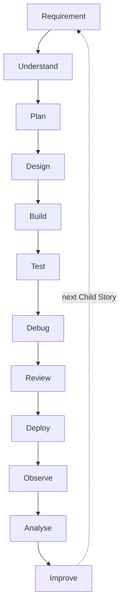

# Technology AI Workspace

Single entry point for using AI on Build Me work. Every Child Story follows the same twelve-stage workflow, and each stage has a defined input, output, and place to look.

This workflow replaces the nine-stage flow in [Technology AI Workflow](../standards/technology-ai-workflow.md) and [Technology AI Workspace](../standards/technology-ai-readme.md); those files still describe the older stages and need aligning. The stage guides in [docs/standards](../standards/README.md) (for example [generate code](../standards/generate-code.md), [generate tests](../standards/generate-tests.md), [debug code](../standards/debug-code.md), [review code](../standards/review-code.md)) remain the prompt-level detail.



## Workflow Stages

| Stage       | AI task                                                          | Output                                                          | Reference                                                                                                                                                                                                                          |
| ----------- | ---------------------------------------------------------------- | --------------------------------------------------------------- | ---------------------------------------------------------------------------------------------------------------------------------------------------------------------------------------------------------------------------------- |
| Requirement | Capture the Child Story as written; do not add scope             | Story text with open questions listed                           | [Child Story requirement understanding prompt](child-story-requirement-understanding-prompt.md)                                                                                                                                    |
| Understand  | Restate the requirement, assumptions, and gaps                   | Confirmed understanding; unknowns marked **Needs Confirmation** | [Requirement understanding](../architecture/requirement-understanding.md)                                                                                                                                                          |
| Plan        | Break the story into small, ordered, testable tasks              | Technical plan                                                  | [Technical design template](../architecture/technical-design-template.md)                                                                                                                                                          |
| Design      | Propose API, data, UI, and security design for review            | Design and contract documents                                   | [AI design guide](design.md), [API standards](../api/standards.md)                                                                                                                                                                 |
| Build       | Implement the smallest change that meets the plan                | Code and tests in a reviewable change                           | [Generate code](../standards/generate-code.md), [Implementation approach](../standards/implementation-approach.md)                                                                                                                 |
| Test        | Write and run unit, integration, security, and performance tests | Recorded test results                                           | [AI testing workflow](../testing/ai-testing-workflow.md)                                                                                                                                                                           |
| Debug       | Reproduce, find the cause, fix, and verify                       | Verified fix with evidence                                      | [AI debugging workflow](../operations/ai-debugging-workflow.md)                                                                                                                                                                    |
| Review      | Check the change against the plan, standards, and safety rules   | Reviewed change                                                 | [AI safety rules](../security/ai-safety-rules.md)                                                                                                                                                                                  |
| Deploy      | Release through the CI/CD workflows with rollback ready          | Deployed change                                                 | [Deployment documentation](../deployment/README.md), [Rollback guide](../deployment/rollback-guide.md)                                                                                                                             |
| Observe     | Watch errors, performance, and availability after release        | Observations and incidents                                      | [Error monitoring](../operations/error-monitoring-approach.md), [Performance observation](../operations/performance-observation.md)                                                                                                |
| Analyse     | Compare results with the expected outcome and KPIs               | Analysis record                                                 | [Feature analytics review](../analytics/feature-analytics-review.md), [Technology KPI review](../operations/technology-kpi-review.md)                                                                                              |
| Improve     | Turn findings into tracked, measured changes                     | Backlog items and lessons                                       | [Improvement backlog](../planning/improvement-backlog.md), [Improvement process](../planning/improvement-process.md), [Technical debt register](../planning/technical-debt-register.md), [Lessons log](../planning/lessons-log.md) |

## Foundation Commands

| Purpose                                     | Command                 |
| ------------------------------------------- | ----------------------- |
| Workspace tests                             | `pnpm test`             |
| API security tests (API on port 3000)       | `pnpm test:security`    |
| Website performance test (Web on port 5173) | `pnpm test:performance` |
| Full foundation health check                | `pnpm review:kpis`      |

Run `pnpm review:kpis` before starting a feature to confirm the foundation is healthy, and again after delivery to compare.

## Working Rules

- Do not move to the next stage until the current stage's output exists.
- Mark anything not confirmed as **Needs Confirmation**; do not invent requirements, targets, or evidence.
- Report only results that were actually observed; state which checks were not run.
- Keep each change small and reversible.
- Never put secrets, personal data, or production credentials into prompts or AI output.
- Follow the [AI safety rules](../security/ai-safety-rules.md) at every stage.
- Record what worked and what failed in the [Lessons log](../planning/lessons-log.md) after each Child Story.

## Stage Record

Add this to the Child Story or pull request:

```text
Child Story:
Requirement:           done / link
Understand:            done / link
Plan:                  done / link
Design:                done / link
Build:                 done / link
Test:                  done / link, results
Debug:                 done / link, or not needed
Review:                done / link
Deploy:                done / link, or not yet
Observe:               done / link, or not yet
Analyse:               done / link, or not yet
Improve:               backlog and lessons links
```
