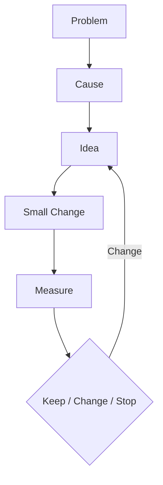

# Improvement Process

## Purpose

Make improvements small, evidence-based, and reversible. Every item in the [Improvement Backlog](improvement-backlog.md) moves through the same six steps.



## Steps

| Step                 | Question                                         | Output                                                                             |
| -------------------- | ------------------------------------------------ | ---------------------------------------------------------------------------------- |
| Problem              | What is going wrong, and what is the evidence?   | A one-sentence problem with a link to the source (KPI report, incident, feedback)  |
| Cause                | Why is it happening?                             | A confirmed cause, not a guess; mark unconfirmed causes as **Needs Confirmation**  |
| Idea                 | What could remove the cause?                     | One or more options; pick the simplest that addresses the cause                    |
| Small Change         | What is the smallest change that tests the idea? | A change that can be delivered, reviewed, and rolled back on its own               |
| Measure              | How will we know it worked?                      | A metric, its baseline, and the date to re-measure, agreed before the change ships |
| Keep / Change / Stop | What did the measurement show?                   | One decision, recorded with the reason                                             |

## Decisions

- **Keep:** the measure improved; adopt the change and update any affected standard or doc.
- **Change:** the measure moved but not enough, or the cause was wrong; return to Idea with what was learned.
- **Stop:** no improvement or a harmful side effect; roll back using the [Rollback Guide](../deployment/rollback-guide.md) where needed and close the item.

## Rules

- Work on one change per problem at a time, so the result can be attributed.
- Take the baseline before the change; reuse `pnpm review:kpis` ([Technology KPI Review](../operations/technology-kpi-review.md)) where it covers the metric.
- Do not start a change without a measure and a re-measure date.
- Security issues and delivery blockers skip the queue; the process still applies.

## Record

Add this to the backlog item, or link it from the item:

```text
Item ID:
Problem and evidence:
Cause:
Idea chosen (and alternatives rejected):
Small change (link to PR or commit):
Measure, baseline, target, re-measure date:
Result:
Decision (Keep / Change / Stop) and reason:
Follow-up items:
```
